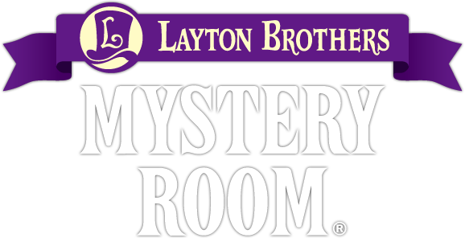

<div align=center>



</div>
<h1 align=center>Layton Brothers: Mystery Room — Nintendo Switch port</h1>

A wrapper/port of the Android release of **Layton Brothers: Mystery Room**
(`com.Level_5.MysteryRoomENG`, v1.1.3, Unity 6000.0.58f2 / IL2CPP). It loads the
original game binaries (`libunity.so` / `libil2cpp.so`, arm64) natively, resolves
their imports against native Switch implementations and patches them so the game
runs as if inside a minimal Android environment..

## How to install

Create a folder for the game on your SD card, `/switch/laytonbmr_nx/`, and place:

1. `laytonbmr_nx.nro`
2. `libmain.so`, `libunity.so`, `libil2cpp.so` — from the `lib/arm64-v8a/` folder
   of `config.arm64_v8a.apk`.
3. `assets/bin/Data/` — the player data, merged from **both** the base APK
   (`com.Level_5.MysteryRoomENG.apk`) and the asset pack (`UnityDataAssetPack.apk`);
   each holds part of `assets/bin/Data/**`, so extract both and merge them into one
   folder.

```
/switch/laytonbmr_nx/
  laytonbmr_nx.nro
  libmain.so  libunity.so  libil2cpp.so
  assets/bin/Data/
    globalgamemanagers  level0..N  sharedassets*  boot.config
    Managed/Metadata/global-metadata.dat
    ...
```

Launch with a **game override** (hold R while starting a title) or a forwarder —
applet/album mode does not work.

## Configuration

`config.txt` is created next to the `.nro` on first run:

* `screen_width` / `screen_height` — render resolution; `-1` (default) renders at
  1920×1080 landscape.

## Build

devkitA64 plus these portlibs:

```
pacman -S switch-mesa switch-libdrm_nouveau switch-sdl2 switch-zlib
```

## Credits

* **TheOfficialFloW** — the original Android so-loader (gtasa_vita).
* **fgsfds** — the Switch so-loader groundwork reused here.

### Support

If you enjoy my work and want to support me :

[](https://ko-fi.com/D1D1P2MOG)

## Legal

No affiliation with Level-5. "Layton Brothers" is a trademark of its owner.
This repository contains no assets or program code from the original game,
and none may be distributed with builds. Users must extract the required
files from their own legally obtained copy.

Source code is provided under the MIT License (see LICENSE).
